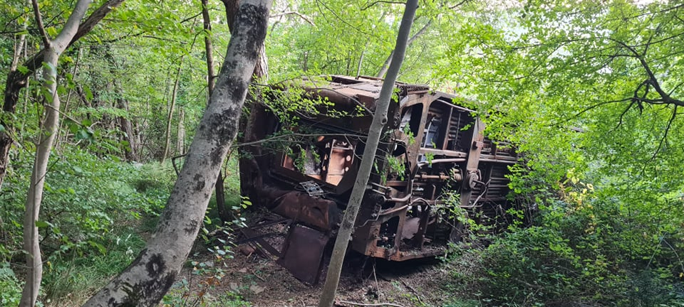

I'm not working till September so I was in my hometown Izola the whole week. I always love going back home. Even more so in the summer, when it feels like I'm on vacation. I have more time to spend with my girlfriend, family, friends and pets.

Me and my girlfriend spent the weekend in Buzet, Croatia with our friends. We had a barbecue, had some drinks, played some card games (Briškola, Taršet, Illusion) and Activity, a cardboard game played in groups. We also went in search for an abandoned train wagon, that derailed a few decades ago. Last few tries to find the wagon were not successfull. This time, however, we finally found it. We did not take the best path and had to walk through a steep and dense forest - many of us were scratched from various obstacles on the way. It was already getting dark but we managed to get back to the house just before dusk. We then hang out, listened to music and played some games.

